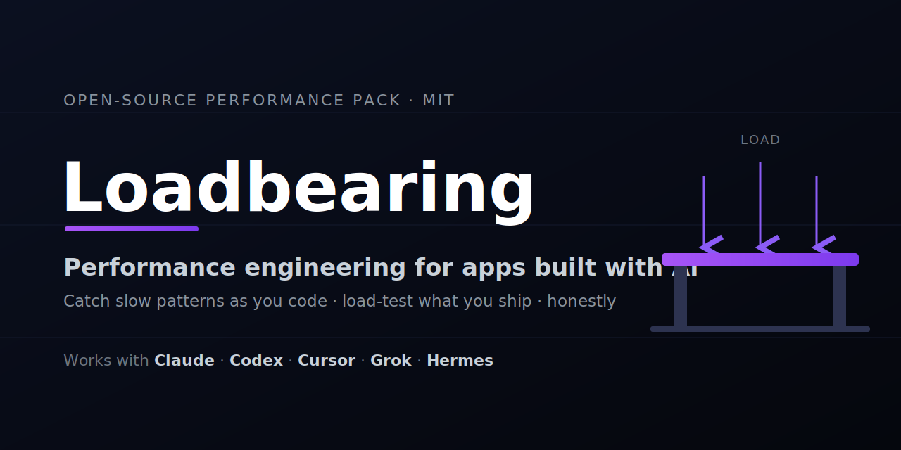

<p align="center">
  
</p>

# Loadbearing

[](LICENSE) [](AGENTS.md) [](CONTRIBUTING.md) 

> **Will your AI-built app survive real traffic?** Loadbearing catches the slow patterns *as you write them* and load-tests what you ship — honestly.

**A performance-engineering pack for apps built with AI.**
You shipped something with an AI coding tool. It works on your laptop. Now the
question is: *will it fall over when real people show up?* Loadbearing helps you
answer that — and fixes the most common problems *before* they ever ship.

---

## ⚠️ Read this first: what Loadbearing can and cannot do

> **Loadbearing finds limits and reduces risk. It does not — and cannot — guarantee
> your app "won't fail."**
>
> A load test does not *prove* a system is safe. It shows how your system
> behaved **under the specific scenarios you tested**, on the day you tested
> them. Real traffic is messier: different data, different timing, third-party
> services having a bad day. Loadbearing makes failures *less likely* and shows you
> *where the edges are* — it does not make your app invincible. Any report that
> claims otherwise is lying to you.

That honesty is the point. Everything here is built to give you a *real* signal
(a test that passes or fails for a concrete reason), not a reassuring vibe.

---

## Works with any AI agent

Loadbearing is **agent-agnostic**. The valuable content — the rules, the skills,
and the runnable scripts — is plain text, so it works with **Claude, Codex,
Cursor, Grok, Hermes, Aider, OpenCode, or plain ChatGPT**. The only thing that
differs between them is *discovery*:

- **Claude Code** loads it natively as a plugin — skills, commands, the
  `perf-reviewer` agent, and the write-time hooks all auto-register.
- **Every other agent** uses [`AGENTS.md`](AGENTS.md), a manual index pointing to
  every rule, skill, and script — plus the portable CLI
  (`node hooks/perf-scan.js <files>`) that runs anywhere, including pre-commit
  hooks and CI.

Same rules, same checks, same scripts — whatever agent you build with.

---

## Who this is for

People who built something real with AI and now need it to hold up under
traffic — vibe coders, solo SaaS builders, and engineering teams alike.

**You do not need to already know** what "p95 latency," "connection pooling," or
an "N+1 query" is. Every rule, hook, and report explains the term in plain
language and tells you *why it hurts at scale*. If you're a professional, the
underlying checks are still rigorous — nothing is dumbed down, just explained.

---

## The two layers

| Layer | When it runs | What it does |
|-------|-------------|--------------|
| **Prevention** | As you write code | Rules + hooks catch known performance-killers (N+1 queries, SELECT *, blocking calls in a request, missing pagination) the moment they're written, and explain why each will hurt under load. |
| **Verification** | On demand | Skills + a real k6 load test put your app under simulated traffic and give you a pass/fail result against targets you set, plus an honest report. |

The **prevention layer is the centerpiece.** Most performance disasters are a
handful of well-known patterns repeated everywhere. Catching them at write-time
is far cheaper than discovering them at 2 a.m. on launch day.

---

## What's inside

| Folder | What it holds |
|--------|---------------|
| `rules/` | Always-follow guardrails, each with a plain-language "why this matters at scale." |
| `hooks/` | 4 write-time detectors (SELECT *, unbounded query, N+1, fetch-without-timeout) that flag bad patterns as you save files. The differentiator. |
| `skills/` | 6 workflows: define targets, run a load test, diagnose bottlenecks, add observability, readiness review, write the report. |
| `agents/` | perf-reviewer, which audits a code diff for the issues above. |
| `commands/` | /loadtest, /perf-audit, /perf-review. |
| `examples/` | Good-pattern snippets for Next.js + Supabase, and a zero-dependency demo app to practice load testing safely. |
| `adapters/` | Per-agent glue and notes — Claude, Codex, Cursor, Grok, Hermes, and beyond. |

---

## Quick start

### Claude Code (native plugin)
```
/plugin marketplace add https://github.com/mehbul/loadbearing
/plugin install loadbearing@loadbearing
```
Skills, commands, the perf-reviewer agent, and the write-time hooks load
automatically. Restart when prompted.

### Any other agent (Codex, Cursor, Grok, Hermes, ChatGPT…)
Point your agent at [`AGENTS.md`](AGENTS.md) and tell it:
> "Read AGENTS.md and follow the relevant section for my task."

Run the detectors anywhere — no agent required:
```bash
node hooks/perf-scan.js <files>      # exit 1 if any issue is found, else 0
```
Or vendor the pack into a project's config folder:
```bash
./install.sh <your-project-dir>      # macOS / Linux
.\install.ps1 <your-project-dir>     # Windows PowerShell
```

**Verify a fresh clone is healthy:** `./install.sh check` (or `.\install.ps1 check`).

**Requirements:** Node.js (for the hooks) and k6 for load tests.

---

## Try it in 60 seconds (safe, local)

```bash
node examples/demo-app/server.js     # a safe localhost target (terminal 1)
# terminal 2, should PASS:
k6 run -e TARGET_URL=http://localhost:3000/fast skills/run-load-test/scripts/load-test.js
# should FAIL (endpoint sleeps 800ms > 500ms p95 target):
k6 run -e TARGET_URL="http://localhost:3000/slow?ms=800" -e P95_MS=500 skills/run-load-test/scripts/load-test.js
```

---

## Contributing

Found a performance footgun we don't catch yet? Survived a rough launch day?
See [CONTRIBUTING.md](CONTRIBUTING.md), including a template for submitting a real
launch-day postmortem as a case study.

## License

MIT © 2026 Mehbul Islam

---

*Built something with AI and worried it will buckle under load? Try Loadbearing — and ⭐ the repo if it helps.*
